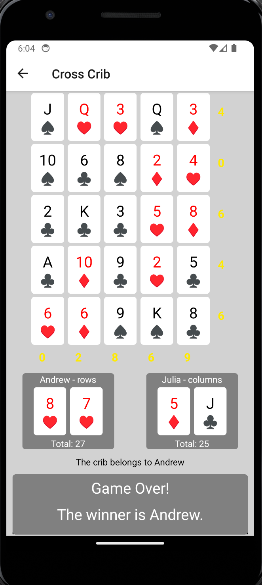

# Cross Crib: React-Native App

Cross Crib is a captivating card game typically played with 2 or 4 participants. This app, however, exclusively supports a 2-player mode. Players engage on a single local device, taking turns by passing the device between them.  [See here for Cross Crib rules](https://www.ultraboardgames.com/crosscribb/game-rules.php).

## Purpose

This app was primarily developed as a sandbox to explore and experiment with the capabilities of React-Native.

## Deployment and Compatibility

The app is deployed using Expo. As of 2023, due to evolving software updates, deploying with the latest versions of Expo does not work and current versions of expo on iOS don't support the older SDK. However, the app's APK can be downloaded from the releases page and run in an Android Emulator using Android API version 34.

## Gameplay Instructions

- **Green Squares**: Represents empty slots.
- **Blue Squares**: Denote face-down cards. The app remains in suspense, not revealing a new card until the player taps on the blue "draw" pile, ensuring only the current player views their card.
- **Placing Cards**: The player taps a green square to place their card, either in their crib or on the game board.
- **Scoring**: The app dynamically calculates scores for rows, columns, and individual players.
- **Game Conclusion**: Upon reaching the end, a winner screen declares the victor.

## Screenshots
Start Screen

Gameplay

Winner Screen

